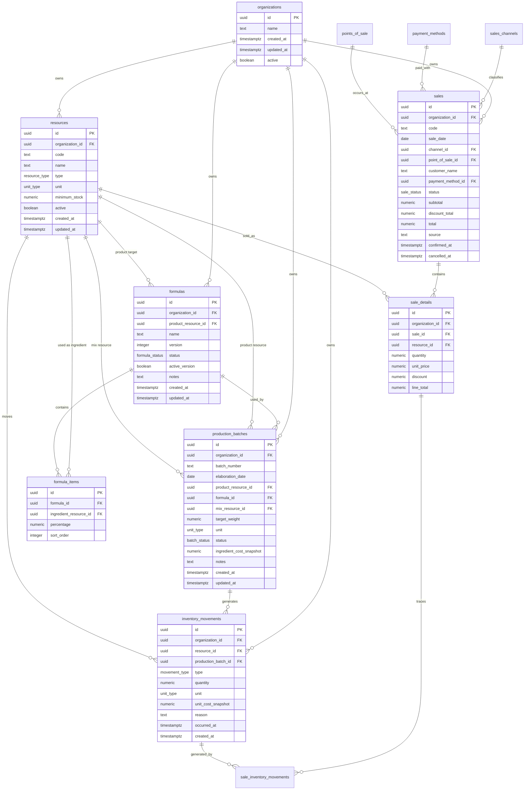

# ERD inicial - Eter ERP v0.1

## Lectura del modelo

- `resources` es la entidad base para todo lo inventariable.
- Una formula puede pertenecer a un producto o quedar como experimental si `product_resource_id` es nulo.
- `formula_items.percentage` es la fuente de verdad de la receta.
- Al crear un lote se genera un recurso tipo `mix`, que representa la mezcla elaborada.
- El stock actual se calcula desde `inventory_movements`.
- Los movimientos de consumo de materia prima se guardan con cantidad negativa.
- Los movimientos de creacion de mezcla se guardan con cantidad positiva.
- Una venta confirmada descuenta recursos de tipo `product` mediante movimientos `sale`.
- Una venta anulada devuelve stock mediante movimientos `sale_cancellation`.
- Ventas v0.1 no consume FIFO por lote porque el envasado por lote aun no esta implementado.
